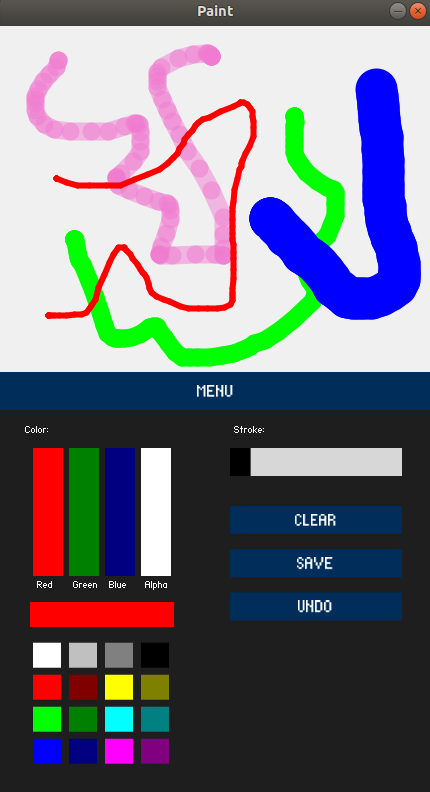

# Painter
Drawing application

## Table of contents
* [General info](#general-info)
* [Screenshots](#screenshots)
* [Technologies](#technologies)
* [Setup](#setup)
* [Features](#features)

## General info
Project made for the subject Applications for Mobile Devices on the Universitat de Valencia during my Erasmus+ exchange. The project was made to get familiar with prototyping mobile applications using Processing.

## Screenshots

## Technologies
* Processing - version 3.5.4
* ControlP5

## Setup
The program can be run on Processing using Java mode. It can also be run on Android mode but it is not recommended because the ControlP5 library does not work well on Android mode.

## Features
* drawing on the screen
* choosing defined colors
* creating own colors adjusting RGB and alpha values
* adjusting the thickness of the brush
* clearing the screen
* undoing changes
* saving drawn pictures
